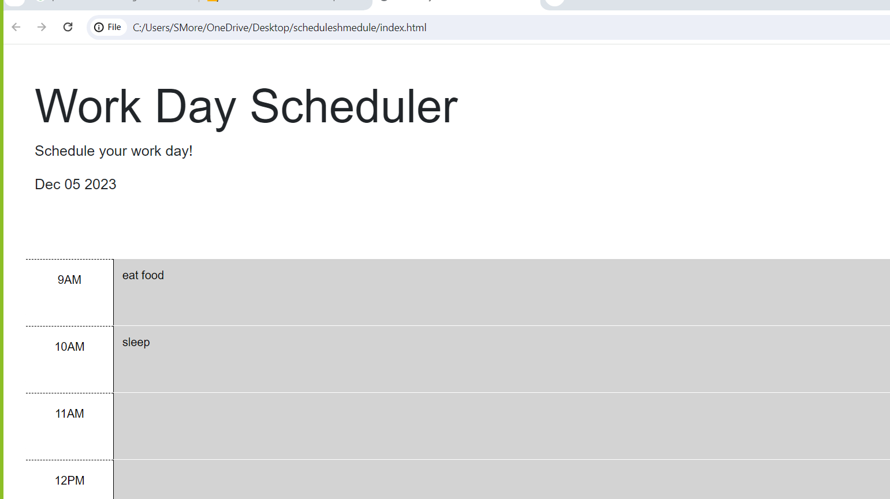

# Workday Scheduler

## Description

Scroll through the various times and set whatever you need to do by typing text into space and clicking the button. 

## Table of Contents 

- [Installation](#installation)
- [Usage](#usage)
- [Credits](#credits)
- [License](#license)

## Installation

No need to install anything except a browser that can read html/javascript

## Usage

for planning and scheduling work day

    ```md
    
    ```

## Credits

Ask BcS, W3 schools, MDN, Ricardo Torres-Castro

## License

None
